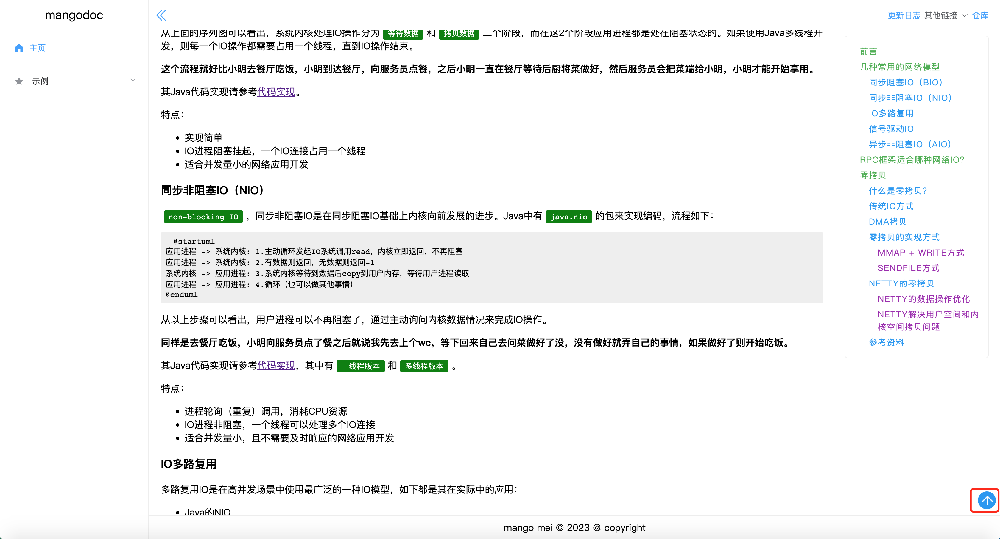

# mangodoc-top
mangodoc top plugin，集成top插件！

[](https://www.npmjs.com/package/mangodoc-top)




## Usage
1. Insert script into mangodoc document:

    ```html
    <!-- top插件  -->
    <link rel="stylesheet" href="https://unpkg.com/mangodoc-top@1.0.0/dist/top.css">
    <script src="https://unpkg.com/mangodoc-top@1.0.0/dist/mangodoc-top.min.js"></script>
    ```
